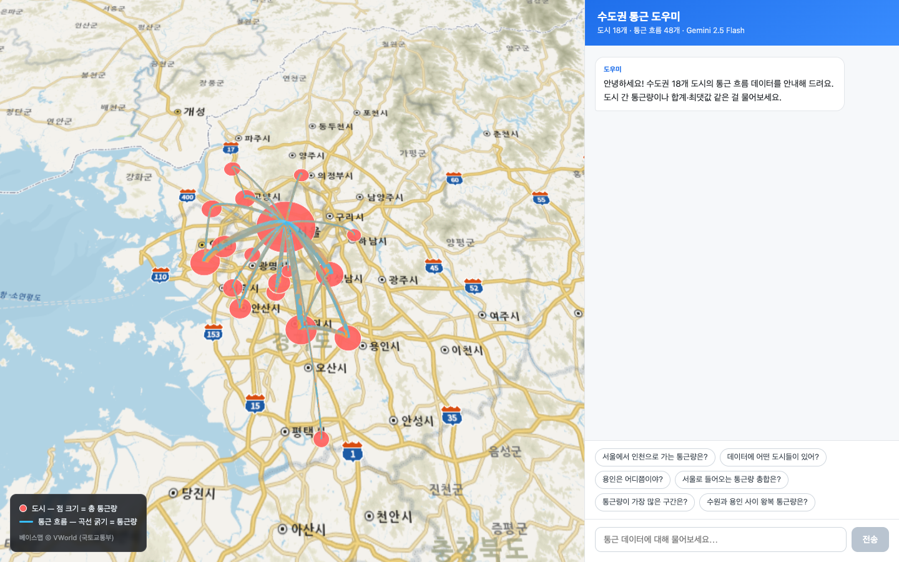

# Lab 0 — 예시 결과물 (강사용 참고 구현)

> 이 폴더는 **`../BUILD_SPEC.md` 를 그대로 AI 코딩 에이전트에 넣어 바이브 코딩으로
> 만든 완성 예시**입니다. 학생들에게 "스펙대로 만들면 결과물이 이렇게 나온다"를
> 보여 주는 용도입니다.
>
> ⚠️ 학생들은 *직접* 만들어야 하므로, 배포 전 이 폴더를 빼거나 따로 보관하세요.

수도권 18개 도시의 통근 흐름을 지도에 시각화하고, 옆 채팅창에서 데이터를
자연어로 물어보면 Gemini 가 답해 주는 한 페이지 웹 앱입니다.



---

## 실행 방법

```bash
cd example_solution
npm install          # 의존성 설치 (최초 1회)
npm run dev          # 개발 서버 → http://localhost:5173
```

`.env` 에 이미 키 2개가 들어 있습니다 (강사 PC 기준). 다른 PC에서 쓰려면:

```bash
cp .env.example .env   # 그리고 .env 안의 두 키를 채운다
```

| 키 | 용도 | 발급처 |
|---|---|---|
| `GEMINI_API_KEY` | 채팅(LLM). **브라우저에 노출 안 됨** — Vite 프록시에서만 사용 | <https://aistudio.google.com/apikey> |
| `VITE_VWORLD_KEY` | VWorld 베이스맵 타일 | <https://www.vworld.kr> |

---

## 무엇이 어디에 구현돼 있나 (BUILD_SPEC 대조표)

| BUILD_SPEC 항목 | 구현 위치 |
|---|---|
| §1 화면 레이아웃 (지도 65% / 채팅 35%) | `src/App.jsx`, `src/App.css` |
| §2 데이터 (cities 18, flows 48) | `src/data/*.json` |
| §3 지도 — VWorld 베이스맵 + 도시 점 + 흐름 곡선 | `src/components/MapView.jsx` |
| §4 채팅 — AI 도우미 UI / 대화 흐름 | `src/components/ChatPanel.jsx` |
| §4 AI 의 역할·동작·응답 규칙 = **시스템 프롬프트** | `src/lib/chat.js` ▶ `buildSystemPrompt()` |
| §4-5 계산 정확도 — JS 로 합계·최댓값 미리 계산 | `src/lib/stats.js` |
| §5 Gemini 키 보안 — Vite 프록시 경유 | `vite.config.js` ▶ `geminiProxyPlugin` |

> `lab1`~`lab5` 에서 뜯어볼 **시스템 프롬프트 · LLM 호출 · 데이터 처리** 가
> 바로 `src/lib/chat.js` 와 `src/lib/stats.js` 입니다.

---

## 동작 확인 — BUILD_SPEC §4-4 예시 대화 6개

채팅창 추천 칩으로 바로 눌러 볼 수 있습니다. 검증된 기대 답:

| 질문 | 답 |
|---|---|
| 서울에서 인천으로 가는 통근량은? | 520 |
| 데이터에 어떤 도시들이 있어? | 18개 도시 한글 이름 나열 |
| 용인은 어디쯤이야? | 위도 37.2411, 경도 127.177 |
| 서울로 들어오는 통근량 총합은? | 4,040 (도착지가 서울인 17개 흐름 합계) |
| 통근량이 가장 많은 구간은? | 서울→성남, 540 |
| 수원과 용인 사이 왕복 통근량은? | 510 (260 + 250) |

채팅 답변에 등장한 도시는 지도에서 잠시 강조됩니다 (§4-5 선택 기능).

---

## 기술 스택

- **React 18 + Vite 6** — 한 페이지 앱
- **deck.gl 9** — `TileLayer`(VWorld 베이스맵), `ScatterplotLayer`(도시), `ArcLayer`(흐름)
- **Google Gemini 2.5 Flash** — 채팅, Vite 개발 서버 프록시(`/api/chat`)로 호출
